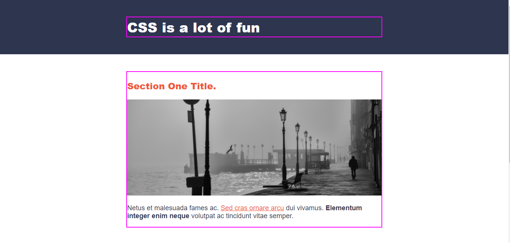
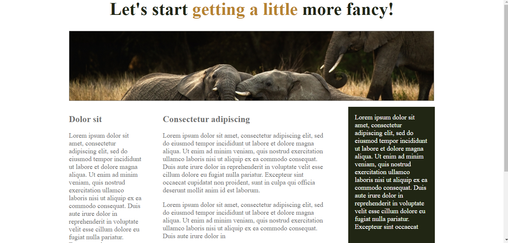
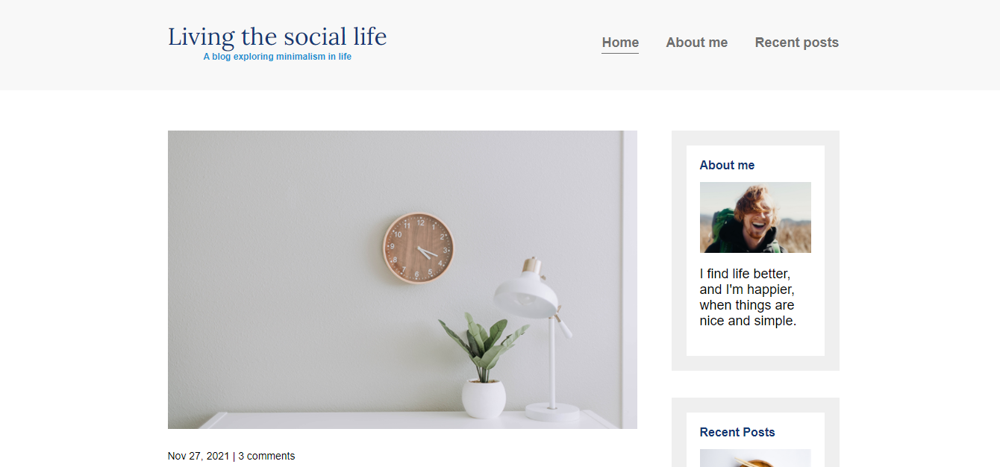
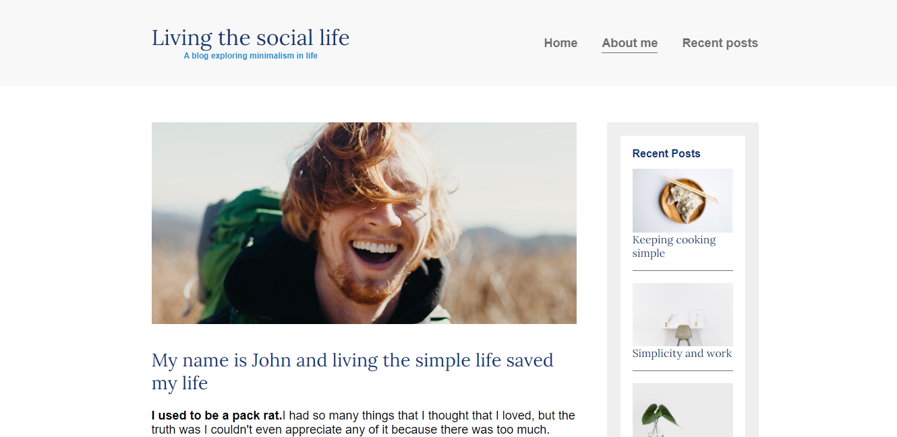
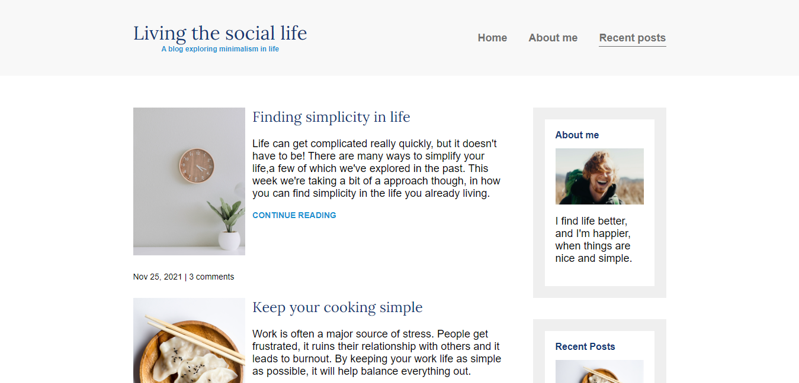

<h1>Responsive web-design</h1>

<h3>First page looks like:</h3>
 

 

<h3>Second page looks like:</h3>
 

 

<h3>Third(a) page looks like:</h3>
 

 

<h3>Third(b) page looks like:</h3>
 

 

<h3>Third(c) page looks like:</h3>
 

